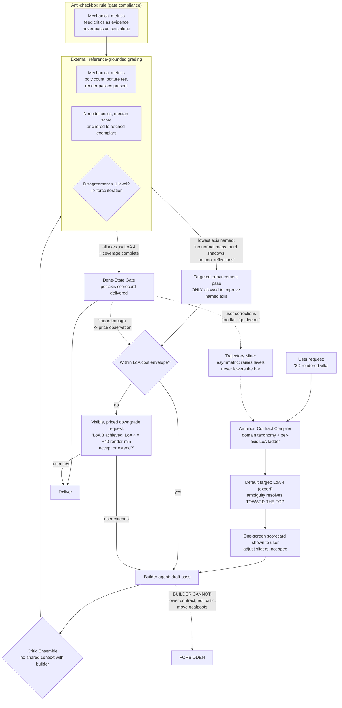

# Ambition Ladder — Progressive Elaboration Loop

Invariants:

1. Builder proposes; only gates dispose.
2. Default LoA = expert; drafts must be *requested* downward.
3. Every iteration targets a named, observable deficiency.
4. Deflation = user-keyed + priced; never silent.
5. Taxonomy grows from real user corrections (mined, not hand-written) —
   asymmetrically: complaints raise the bar, acceptance only reprices it.
6. Mechanical metrics are evidence for critics, never an axis verdict alone
   (checkbox realism is the gate-compliance failure to design against).
