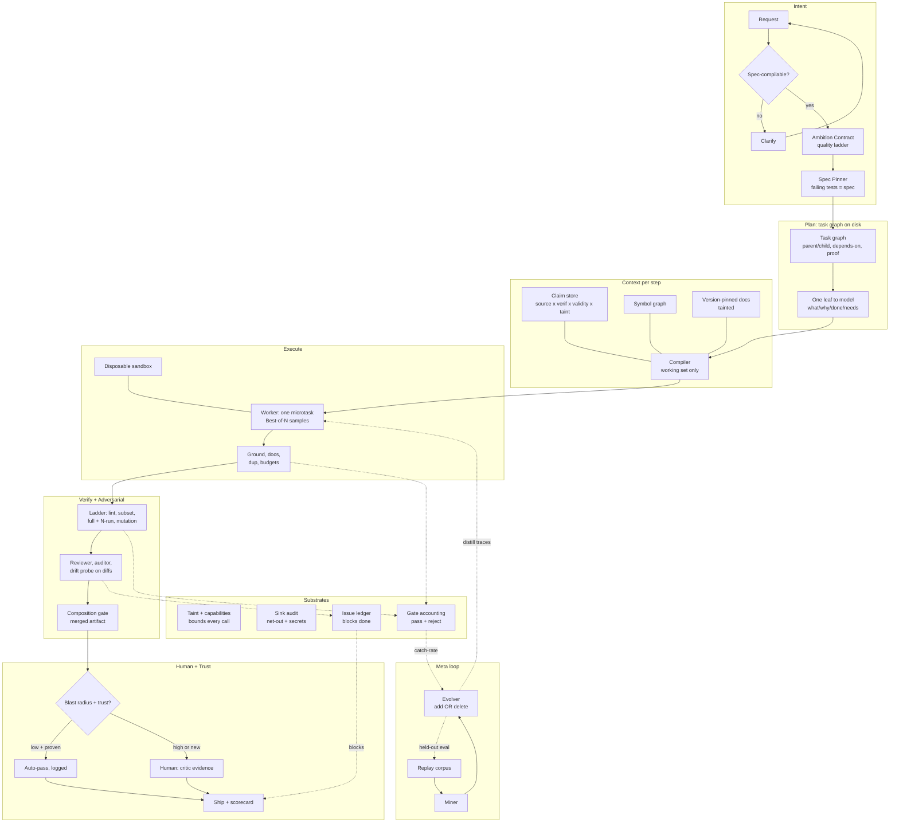

# Architecture — SUPER Harness

- Harness holds the forest (graph); model holds one leaf (F10 fix).
- Gates dispose; model proposes. Every gate logs to earn its keep or be deleted.
- Security + ledger touch every layer; meta loop evolves everything except the grader.
