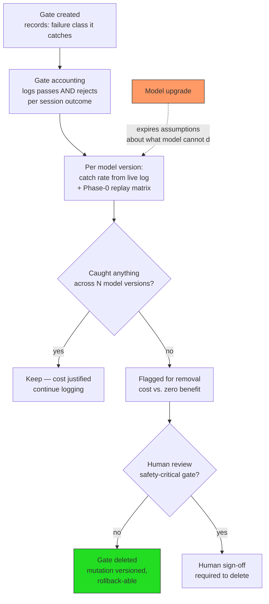

# Gate Decay — the descent operator on the enforcement layer

The failure this prevents (doc 01 F8): gates encode assumptions about model
weaknesses; model updates expire the weaknesses; without descent, the harness
acretes brakes — cost and capability-tax paid to defend failures that no
longer occur.

Invariants:

1. No gate exists without a recorded justifying failure class.
2. Catch rate is computed over both logged outcomes (live) and the replay
   suite (counterfactual), per model version.
3. Zero catch rate across N versions ⇒ flagged; non-safety gates are deleted
   by the evolution agent, safety gates only with sign-off.
4. The evolution loop rewards deletion as much as addition — descent is
   evolution, not erosion.
