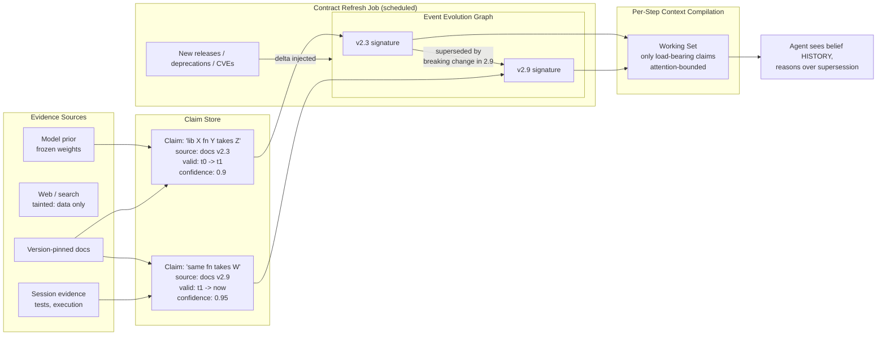

# Knowledge & Memory Layers — typed memory + temporal reasoning

Key property: outdated and current facts are **not competing booleans** in
context; they are one queryable object with validity intervals, so "old answer
vs new answer" becomes a supersession query instead of a conflict that causes
hallucination.

The same supersession applies downward: procedural-store entries ("in this
repo, migrations need `--dry-run`") are **decaying priors** — an executed
contradiction retires a memory exactly as a newer docs version supersedes a
claim. Memory is a cache; disconfirming evidence is its invalidation signal.
