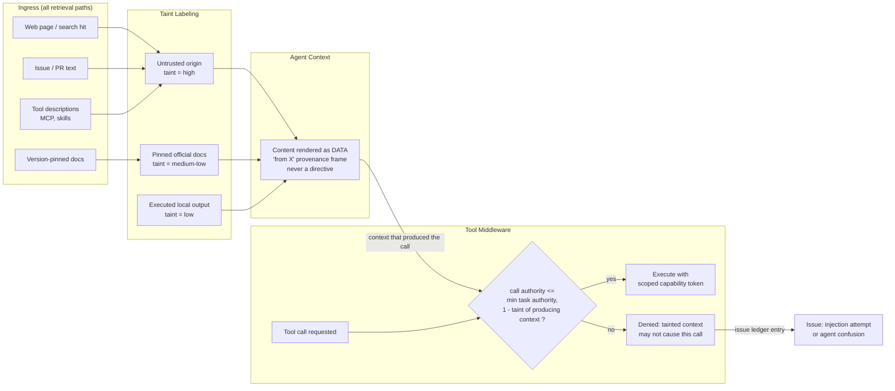

# Taint–Capability Flow — fetched content reduces what the agent may do

The specific pattern this kills: a poisoned page (taint high) instructing the
agent to read `.aws/credentials` and POST it somewhere — the exfiltration-
shaped call requires authority the tainted context cannot grant. The rule is
mechanical and lives in tool dispatch; "the web page said it was fine" is
inadmissible by construction.
