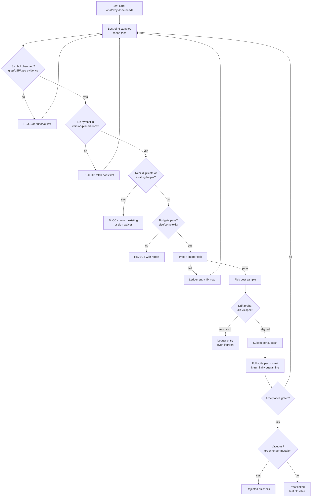

# Write-Gate Flow — one leaf at a time

- Rejection names the missing tool call; the gate teaches.
- Done needs: spec green + non-vacuous tests + no open criticals + proof link.
- No budget/progress → early abort: re-plan or escalate, don't burn steps.
